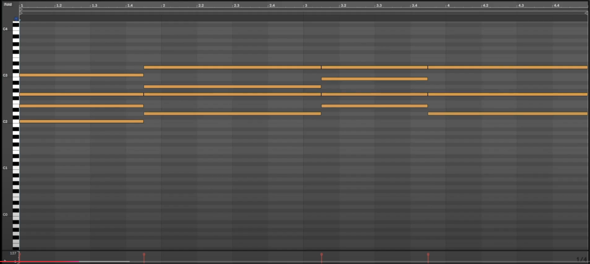

# Piano Roll Interpreter

Convert DAW piano roll screenshots into MIDI files using AI-powered image recognition. This tool analyzes screenshots of piano roll patterns from digital audio workstations and automatically generates corresponding MIDI files, making it easy to transfer musical ideas between different DAWs or share patterns with other musicians.

*NOTE* - This is a work in progress. Currently having trouble translating the image recognition data to the precise data needed to output a 100% accurate MIDI file. Need to rethink how to approach...

## Features

- Automated recognition of piano roll notes from screenshots
- Accurate detection of note positions, lengths, and velocities
- MIDI file generation with preserved timing and velocity information
- Support for complex musical patterns
- Detailed logging for troubleshooting

## Example Screenshot



A good screenshot should include:
1. ✅ Clear beat markers at the top
2. ✅ Visible piano roll grid
3. ✅ Distinct note blocks
4. ✅ Full pattern visible
5. ✅ Clean view without extra UI elements

❌ Avoid:
- Overlapping or cut-off notes
- Missing beat markers
- Blurry or low-resolution images
- Dark themes that make note boundaries unclear
- Screenshots with additional DAW controls or windows

## Prerequisites

- Python 3.8+
- OpenAI API key (GPT-4V access required)
- Required Python packages:
  ```
  openai
  python-dotenv
  Pillow
  midiutil
  ```

## Installation

1. Clone the repository:
   ```bash
   git clone https://github.com/yourusername/piano-roll-interpreter.git
   cd piano-roll-interpreter
   ```

2. Set up a virtual environment:

   **macOS/Linux:**
   ```bash
   # Create virtual environment
   python3 -m venv venv

   # Activate virtual environment
   source venv/bin/activate   # For bash/zsh
   source venv/bin/activate.fish   # For fish
   ```

   **Windows:**
   ```bash
   # Create virtual environment
   python -m venv venv

   # Activate virtual environment
   .\venv\Scripts\activate
   ```

3. Install dependencies:
   ```bash
   pip install -r requirements.txt
   ```

4. Create a `.env` file in the project root and add your OpenAI API key:
   ```
   OPENAI_API_KEY=your_api_key_here
   ```

5. When you're done working on the project, deactivate the virtual environment:
   ```bash
   deactivate
   ```

## Usage

Make sure your virtual environment is activated, then run the script from the command line with two arguments:
1. Path to the input screenshot
2. Desired output MIDI file path

```bash
python app.py test_image.png output_pattern.mid